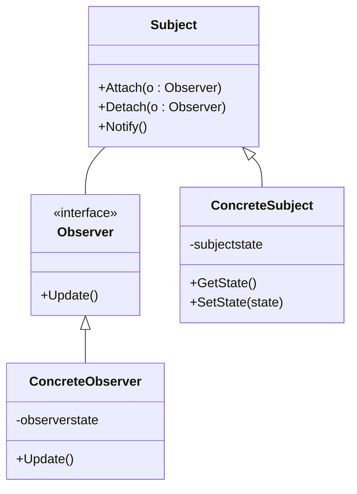

```mermaid
classDiagram
    class Subject {
        +Attach(o : Observer)
        +Detach(o : Observer)
        +Notify()
    }
    class Observer {
        <<interface>>
        +Update()
    }
    class ConcreteSubject {
        -subjectstate
        +GetState()
        +SetState(state)
    }
    class ConcreteObserver {
        -observerstate
        +Update()
    }

    Subject -- Observer
    Subject <|-- ConcreteSubject
    Observer <|-- ConcreteObserver
```
